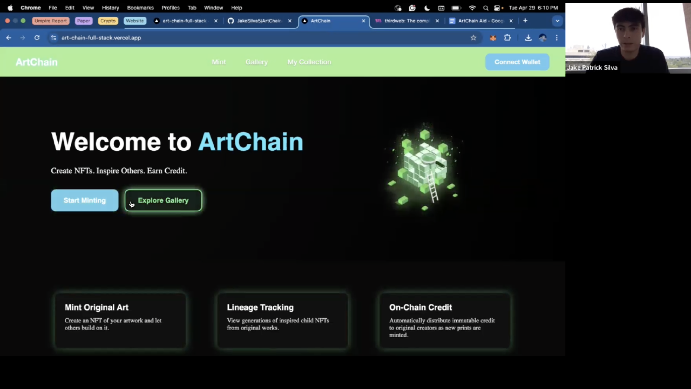

# ArtChain
ArtChain is a decentralized NFT art gallery built to empower artists by minting original art as NFTs, facilitating lineage tracking of inspired derivatives, and automatically crediting original or "inspired by" creators.

## Features
- **Mint Original Art**: Easily create NFTs of your artwork.
- **Gallery**: View all minted NFTs.
- **My Collection**: Manage and display NFTs owned by your connected wallet.
- **Lineage Tracking**: Keep track of child NFTs inspired by original works.

## Installation and Configuration

### Prerequisites
Ensure you have the following installed:
- [Node.js](https://nodejs.org/) (v16 or later)
- npm or yarn

### Install Dependencies
npm install
or
yarn install

## Running the Application

### Development Server
npm install
or
yarn install

Open [http://localhost:3000](http://localhost:3000) to view it in your browser.

## Testing 
Ensure all functionalities are working correctly by navigating through the main pages:

- `/mint`: Test the minting functionality.
- `/gallery`: Verify display of minted NFTs.
- `/collection`: Confirm wallet connection and display of owned NFTs.

For specific NFT details and lineage, visit:

- `/[id]`: Replace `[id]` with your specific NFT identifier.
- `/mint?id=[id]`: Create an inspired-by NFT from an existing NFT.

### Demo Video:

## License
MIT License

## Acknowledgments
Developed by Jake Silva as a project for CMPSC 263 (Web Dev). This prokect utilizes Next.js, React, styled-components, ethers.js, and Thirdweb tools.
